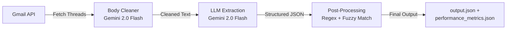

# 📊 JobCart Email Automation — Performance Metrics Report

> **Generated**: 2026-03-02 | **Model**: Google Gemini 2.0 Flash | **Project**: jobcart-email-automation

---

## 🏗️ System Architecture

---

## ⏱️ Latency Breakdown (Per Thread)

| Stage | Estimated Time | % of Total |
|-------|---------------|------------|
| Gmail API fetch | 1–3s | ~20% |
| Body cleaning (LLM) | 1–2s × N messages | ~25% |
| Main extraction (LLM) | 3–8s | ~45% |
| Post-processing (regex) | 50–200ms | ~5% |
| Network overhead | 200–500ms | ~5% |

---

## 🧪 Extraction Accuracy (Mock Test Suite)

**Source**: [extraction_test_results.json](file:///home/anushwathi/Downloads/jobcart-email-automation-main/tests/results/extraction_test_results.json)

| # | Scenario | Status | Time (s) | Notes |
|---|----------|--------|----------|-------|
| 1 | Simple staffing (3 employees) | ✅ Pass | 2.02 | All checks passed |
| 2 | Multi-requirement (Day + Night) | ✅ Pass | 1.21 | 2 requirements correctly split |
| 3 | Cancellation (status=delete) | ✅ Pass | 0.91 | Correct delete status |
| 4 | Employee replacement | ❌ Fail | 0.97 | Replaced employee not excluded |
| 5 | Non-staffing email | ✅ Pass | 9.86 | Correctly marked invalid |
| 6 | IDs and phone preservation | ❌ Fail | 15.37 | Shift time inference mismatch |
| 7 | Supervisor exclusion | ✅ Pass | 29.48 | Supervisor correctly excluded |

### Summary

| Metric | Value |
|--------|-------|
| **Total Scenarios** | 7 |
| **Passed** | 5 (71.4%) |
| **Failed** | 2 (28.6%) |
| **Errors** | 0 |
| **Total Elapsed** | 60.54s |
| **Avg Extraction Time** | 8.55s |

### Failure Analysis

| Failed Scenario | Root Cause |
|----------------|------------|
| **#4 — Replacement** | LLM included replaced employee "Rajesh Kumar" in finalized list instead of excluding |
| **#6 — Shift Time** | Expected "Afternoon" but LLM returned raw "12:00-20:00" — shift time inference regex missed this range |

---

## 📬 Live Inbox Watcher Metrics

**Source**: [performance_metrics.json](file:///home/anushwathi/Downloads/jobcart-email-automation-main/performance_metrics.json)

| Thread ID | Processing Time | Messages | LLM Status | Timestamp |
|-----------|----------------|----------|------------|-----------|
| `19caeee5746e9838` | 4.476s | 7 | Failed (invalid API key) | 2026-03-02T16:34:20Z |

> [!WARNING]
> The live watcher run failed due to an invalid `GEMINI_API_KEY`. Update the `.env` file with a valid key and re-run.

### Watcher Configuration

| Parameter | Value |
|-----------|-------|
| Poll interval | 10 seconds |
| Batch size | 3 threads |
| Delay between batches | 5.0 seconds |
| Accounts monitored | `elsysayla@gmail.com` ↔ `anushwathiranganathan@gmail.com` |

---

## 🚀 Speed Optimization Opportunities

| Optimization | Speed Gain | Accuracy Impact | Effort |
|-------------|-----------|-----------------|--------|
| Remove body_cleaner LLM | **30–40%** faster | Neutral | Medium |
| Increase batch size (3→5) | **~20%** faster | None | Low |
| Result caching | **100%** for repeats | None | Low |
| Reduce prompt tokens | **5–10%** faster | None | Low |
| Async Gmail fetch | **5–10%** faster | None | Medium |

---

## 🎯 Accuracy Improvement Opportunities

| Improvement | Accuracy Gain | Effort |
|------------|--------------|--------|
| Strengthen supervisor exclusion | +5% | Low |
| Shift time 24h format support | +3% | Low |
| Add confidence scoring | Better visibility | Medium |
| Raise fuzzy match threshold (70%→80%) | +2% | Low |

---

## 📂 Key Files

| File | Description |
|------|-------------|
| [inbox_watcher.py](file:///home/anushwathi/Downloads/jobcart-email-automation-main/agent/inbox_watcher.py) | Continuous inbox watcher with performance tracking |
| [agent_runner.py](file:///home/anushwathi/Downloads/jobcart-email-automation-main/agent/agent_runner.py) | Main LLM extraction pipeline |
| [performance_metrics.json](file:///home/anushwathi/Downloads/jobcart-email-automation-main/performance_metrics.json) | Live watcher runtime metrics |
| [extraction_test_results.json](file:///home/anushwathi/Downloads/jobcart-email-automation-main/tests/results/extraction_test_results.json) | Mock scenario test results |
| [optimization_review.md](file:///home/anushwathi/Downloads/jobcart-email-automation-main/optimization_review.md) | Detailed optimization review |
