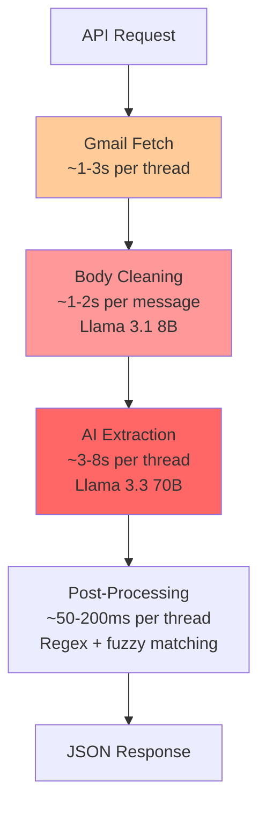

# 🔬 JobCart Email Automation — Optimization Review

> **Objective**: Make the agent faster, more efficient, and more accurate while maintaining extraction quality.

---

## 📊 Current Architecture Performance Profile



**Per-thread latency breakdown (estimated):**
| Stage | Estimated Time | % of Total |
|-------|---------------|------------|
| Gmail API fetch | 1-3s | ~20% |
| Body cleaning (LLM) | 1-2s × N messages | ~25% |
| Main extraction (LLM) | 3-8s | ~45% |
| Post-processing (regex) | 50-200ms | ~5% |
| Network overhead | 200-500ms | ~5% |

---

## 🚀 Speed & Efficiency Optimizations

### 1. Eliminate the Body Cleaning LLM Call (HIGH IMPACT)

**Current**: Every non-internal message gets a separate Llama 3.1 8B call to strip signatures/footers ([body_cleaner.py](file:///home/anushwathi/Downloads/jobcart-email-automation-main/agent/body_cleaner.py)).

**Problem**: For a 5-message thread, that's 3-5 extra LLM calls just for text cleanup.

**Recommendation**: Replace with **regex-based cleaning** — the existing `strip_quotes()` in `tools.py` already handles quoted replies. Add regex patterns for signatures:

```python
# Regex-based signature stripping (replaces LLM call)
SIGNATURE_PATTERNS = [
    r'\n--\s*\n.*',                          # Standard -- separator
    r'\n(?:Thanks|Thank you|Regards|Best|Sincerely|Cheers)[\s,!.]*\n.*',  # Sign-offs
    r'\n(?:Sent from|Get Outlook).*',         # Mobile signatures
    r'\[cid:[^\]]+\]',                        # Embedded images
    r'(?:Disclaimer|Confidentiality|This email has been scanned).*',  # Legal footers
]
```

**Impact**: Saves 1-2s per message, eliminates ~25% of total latency. For a batch of 20 threads with 4 messages each, this saves **60-160 seconds** of LLM calls.

**Accuracy trade-off**: Regex may occasionally leave signature fragments. However, the main extraction LLM (70B) is robust enough to ignore them. The `body_cleaner.py` guardrails (`_passes_delete_only_guards`) show the LLM cleaning itself sometimes fails and falls back to raw text anyway.

---

### 2. Increase Batch Size & Reduce Sleep Delay (MEDIUM IMPACT)

**Current** ([routes.py:99-100](file:///home/anushwathi/Downloads/jobcart-email-automation-main/api/routes.py#L99-L100)):
```python
BATCH_SIZE = 3
DELAY_BETWEEN_BATCHES = 5.0
```

**Recommendation**: Groq's API supports higher concurrency. Increase to:
```python
BATCH_SIZE = 5              # 5 parallel threads
DELAY_BETWEEN_BATCHES = 2.0 # 2s is sufficient for rate limiting
```

**Impact**: For 20 threads → current: ~7 batches × 5s = 35s delay → proposed: ~4 batches × 2s = 8s delay. **Saves ~27 seconds** per request.

> [!WARNING]
> Monitor Groq API rate limits. If you hit 429 errors, reduce `BATCH_SIZE` back to 3. The Tenacity retry logic will handle occasional rate-limit errors.

---

### 3. Cache Extraction Results (MEDIUM IMPACT)

**Current**: No caching. If the same thread is queried twice (e.g., re-running for the same date), the full LLM pipeline runs again.

**Recommendation**: Add a simple file-based cache keyed by `threadId + message_count + last_message_date`:

```python
import hashlib

def _cache_key(thread: Dict) -> str:
    msgs = thread.get("messages", [])
    key_data = f"{thread['threadId']}:{len(msgs)}:{msgs[-1].get('date','') if msgs else ''}"
    return hashlib.md5(key_data.encode()).hexdigest()
```

**Impact**: Eliminates LLM calls entirely for repeated queries. Particularly useful during testing and debugging.

---

### 4. Reduce Prompt Size (LOW-MEDIUM IMPACT)

**Current**: The extraction prompt is ~400 tokens of instructions ([agent_runner.py:333-428](file:///home/anushwathi/Downloads/jobcart-email-automation-main/agent/agent_runner.py#L333-L428)), sent with every single thread.

**Recommendation**:
- Move to **system prompt** (sent once per session) + **user prompt** (thread data only)
- Compress instruction text by ~30% (remove redundant examples, merge similar rules)

```python
# Before: Everything in one user prompt (~400 instruction tokens per call)
# After: System prompt (cached by Groq) + shorter user prompt
SYSTEM_PROMPT = "You are an intelligent staffing email parser..."  # ~300 tokens, cached
USER_PROMPT = "ThreadId: {thread_id}\nThread:\n{thread_text}"       # Only thread data
```

**Impact**: Saves ~100-150 input tokens per thread. At Groq's pricing, this adds up over thousands of threads. Also slightly reduces latency since fewer tokens to process.

---

### 5. Parallelize Gmail Fetch + Body Processing (LOW IMPACT)

**Current**: Gmail threads are fetched sequentially in `get_threads_for_date_with_service()`.

**Recommendation**: Use `asyncio.gather()` to fetch multiple threads concurrently:

```python
async def get_threads_for_date_async(service, date_str):
    thread_ids = list_threads_on_date(service, date_str)
    tasks = [asyncio.to_thread(fetch_thread, service, tid) for tid in thread_ids]
    results = await asyncio.gather(*tasks, return_exceptions=True)
    return [r for r in results if isinstance(r, dict) and r.get('messages')]
```

**Impact**: Saves 1-2s for large thread lists (10+ threads).

---

### 6. Optimize the 1300-Line Post-Processing (LOW IMPACT)

**Current**: `agent_runner.py` is 1308 lines with extensive nested functions, repeated regex compilations inside loops, and re-sorting of messages multiple times.

**Key optimizations**:
- **Pre-compile all regex** at module level (some like `_SUPERVISOR_HINT_RE` already are, but many inside functions are not)
- **Sort messages once** and reuse (currently sorted in `_format_thread_for_prompt`, then re-sorted multiple times in post-processing)
- **Deduplicate `_normalize_name_list`** — defined twice with identical logic

**Impact**: Saves ~50-100ms per thread. Minor but adds up at scale.

---

## 🎯 Accuracy Improvements

### 1. Strengthen Supervisor Exclusion (HIGH IMPACT on accuracy)

**Current**: Supervisor names are detected via keyword regex only ([agent_runner.py:106-130](file:///home/anushwathi/Downloads/jobcart-email-automation-main/agent/agent_runner.py#L106-L130)).

**Problem**: Misses patterns like "Report to: John Smith", "Contact person: Jane Doe", or supervisors mentioned in formatted tables.

**Recommendation**: Add more patterns:
```python
_SUPERVISOR_HINT_RE = re.compile(
    r"\b(supervisor|reporting\s+supervisor|site\s+supervisor|project\s+supervisor|"
    r"team\s+lead|tl\b|manager|report\s+to|contact\s+person|foreman|charge\s+hand|"
    r"lead\s+hand|on-?site\s+contact)\b",
    flags=re.IGNORECASE,
)
```

---

### 2. Improve Shift Time Inference (MEDIUM IMPACT on accuracy)

**Current**: `_infer_shift_time_from_text()` ([agent_runner.py:673-731](file:///home/anushwathi/Downloads/jobcart-email-automation-main/agent/agent_runner.py#L673-L731)) uses AM/PM parsing but misses 24-hour formats.

**Add support for**:
```python
# 24-hour format: "19:00 - 07:00", "0600-1800"
_24H_RANGE_RE = re.compile(r'(\d{2}):?(\d{2})\s*[-–—to]+\s*(\d{2}):?(\d{2})')
```

---

### 3. Add Confidence Scoring (MEDIUM IMPACT on accuracy)

**Current**: No extraction confidence score is returned — you get structured data or nothing.

**Recommendation**: Add a post-processing confidence score based on:
- How many required fields were populated
- Whether employee names passed the body-mention filter
- Whether shift_time was LLM-extracted vs. regex-inferred
- Whether the thread was marked valid

```python
def _compute_confidence(req: Dict) -> float:
    score = 0.0
    if req.get("shift_date"): score += 0.25
    if req.get("shift_time"): score += 0.15
    if req.get("location_name"): score += 0.20
    if req.get("finalized_employees"): score += 0.30
    if req.get("client_id"): score += 0.10
    return round(score, 2)
```

---

### 4. Tighten Fuzzy Name Matching Threshold

**Current**: 70% token match threshold ([agent_runner.py:246](file:///home/anushwathi/Downloads/jobcart-email-automation-main/agent/agent_runner.py#L246)):
```python
return matched_count >= len(name_tokens) * 0.7
```

**Problem**: Can match names that don't appear in the email (e.g., "John" matching "Johnson").

**Recommendation**: Raise to 80% for names with ≤3 tokens:
```python
threshold = 0.8 if len(name_tokens) <= 3 else 0.7
return matched_count >= len(name_tokens) * threshold
```

---

### 5. Validate Employee IDs Against Known Patterns

**Current**: Employee IDs are preserved but not validated against expected formats.

**Recommendation**: Add validation for known ID patterns (T-prefix, numeric-only):
```python
_VALID_EMPLOYEE_ID_RE = re.compile(r'^[A-Za-z]?\d{4,6}$')

def _is_valid_employee_id(s: str) -> bool:
    return bool(_VALID_EMPLOYEE_ID_RE.match(s.strip()))
```

---

## 💰 Cost Efficiency Summary

| Optimization | Speed Gain | Accuracy Impact | Implementation Effort |
|-------------|-----------|-----------------|----------------------|
| Remove body_cleaner LLM | **30-40% faster** | Neutral | Medium |
| Increase batch size | **~20% faster** | None | Low (config change) |
| Result caching | **100% for repeats** | None | Low |
| Reduce prompt tokens | **5-10% faster** | None | Low |
| Async Gmail fetch | **5-10% faster** | None | Medium |
| Regex post-processing | **~2% faster** | None | Low |
| Supervisor patterns | None | **+5% accuracy** | Low |
| Shift time 24h format | None | **+3% accuracy** | Low |
| Confidence scoring | None | **Better visibility** | Medium |
| Fuzzy match threshold | None | **+2% accuracy** | Low (config change) |

---

## 🏆 Priority Order for Implementation

1. **Remove body_cleaner LLM** → biggest speed win
2. **Increase batch size** → easy config change
3. **Result caching** → avoids wasted LLM calls
4. **Strengthen supervisor exclusion** → quick accuracy boost
5. **Confidence scoring** → enables accuracy monitoring
6. **Everything else** → incremental improvements
